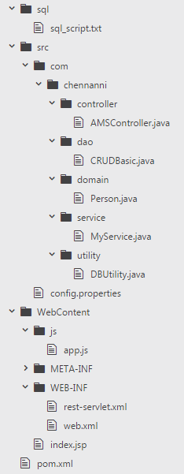
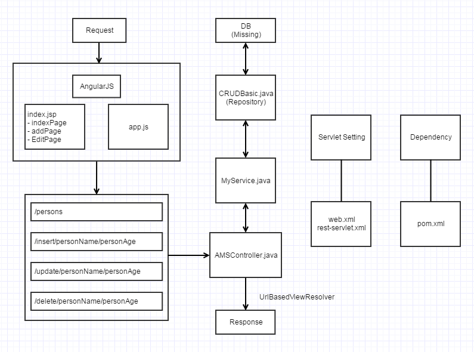

# Account Management System Demo

- Developed an application to manage employees' account information.
- Get data from the server by making AJAX calls in the front-end and built the RESTful web services in the back-end to expose the resources.
- Built the web pages using HTML, Bootstrap and implemented the control flow with AngularJS.
- Used Maven for the dependency management and build process.

## File Structure

## Workflow

